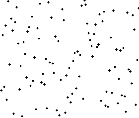

排序算法
=======

 排序算法（Sorting algorithm）最常用的算法之一，是一种能将一串数据依照特定排序方式进行排列的一种算法([维基百科](http://zh.wikipedia.org/wiki/%E6%8E%92%E5%BA%8F%E7%AE%97%E6%B3%95 "Wiki百科"))。排序算法的输出必须遵守下列两个原则：

1. 输出结果为递增串行（递增是针对所需的排序顺序而言）
2. 输出结果是原输入的一种排列、或是重组

虽然排序算法是一个简单的问题，但是从计算机科学发展以来，在此问题上已经有大量的研究。举例而言，冒泡排序在1956年就已经被研究。虽然大部分人认为这是一个已经被解决的问题，有用的新算法仍在不断的被发明。（例子：图书馆排序在2004年被发表）

## 算法分类

    理论        计算复杂性理论 大O符号 全序关系 列表 稳定性 比较排序 自适应排序 排序网络 整数排序
    交换排序    **冒泡排序** 鸡尾酒排序 奇偶排序 梳排序 侏儒排序 **快速排序** 臭皮匠排序 Bogo排序
    选择排序    选择排序 堆排序 平滑排序 笛卡尔树排序 锦标赛排序 圈排序
    插入排序    插入排序 希尔排序 Splay排序 二叉查找树排序 图书馆排序 耐心排序
    归并排序    归并排序 梯级归并排序 振荡归并排序 多相归并排序 列表排序
    分布排序    美国旗帜排序 珠排序 桶排序 爆炸排序 **计数排序** 鸽巢排序 相邻图排序 基数排序 闪电排序 插值排序
    并发排序    双调排序器 Batcher归并网络 两两排序网络
    混合排序    块排序 Tim排序 内省排序 Spread排序 J排序
    其他        拓扑排序 煎饼排序 意粉排序

## 排列算法列表

在以下列表中，n是要被排序的纪录数量以及k是不同键值的数量。

### 稳定的

- 冒泡排序（bubble sort）— O(n2)
- 鸡尾酒排序（cocktail sort,双向的冒泡排序）—O(n2)
- 插入排序（insertion sort）—O(n2)
- 桶排序（bucket sort）—O(n);需要O(k)额外空间
- 计数排序（counting sort）—O(n+k);需要O(n+k)额外空间
- 归并排序（merge sort）—O(n log n);需要O(n)额外空间
- 原地归并排序— O（n2）
- 二叉排序树排序（binary tree sort）— O(n log n)期望时间; O(n2)最坏时间;需要O(n)额外空间
- 鸽巢排序（pigeonhole sort）—O(n+k);需要O(k)额外空间
- 基数排序（radix sort）—O(n·k);需要O(n)额外空间
- 侏儒排序（gnome sort）— O(n2)
- 图书馆排序（library sort）— O(n log n) with high probability,需要(1+ε)n额外空间

### 不稳定

- 选择排序（selection sort）—O(n2)
- 希尔排序（shell sort）—O(n log n)如果使用最佳的现在版本
- 组合排序— O(n log n)
- 堆排序（heap sort）—O(n log n)
- 平滑排序（smooth sort）— O(n log n)
- 快速排序（quick sort）—O(n log n)期望时间, O(n2)最坏情况;对于大的、乱数列表一般相信是最快的已知排序
- 内省排序（introsort）—O(n log n)
- 耐心排序（patience sort）—O(n log n + k)最坏情况时间，需要额外的O(n + k)空间，也需要找到最长的递增子串行（longest increasing subsequence）

### 不实用的排序算法

- Bogo排序— O(n × n!)，最坏的情况下期望时间为无穷。
- Stupid排序—O(n3);递归版本需要O(n2)额外存储器
- 珠排序（bead sort）— O(n) or O(√n),但需要特别的硬件
- Pancake sorting—O(n),但需要特别的硬件
- 臭皮匠排序（stooge sort）算法简单，但需要约n^2.7的时间

## 平均时间复杂度

- 冒泡排序O(n2)
- 选择排序O(n2)
- 插入排序O(n2)
- 归并排序O(n log n)
- 堆排序O(n log n)
- 快速排序O(n log n)
- 希尔排序O(n1.25)
- 基数排序O(n)

说明：虽然完全逆序的情况下，快速排序会降到选择排序的速度，不过从概率角度来说（参考信息学理论，和概率学），不对算法做编程上优化时，快速排序的平均速度比堆排序要快一些。

- 快速排序
- 计数排序
- 梳排序
- 堆排序
- 归并排序
- 希尔排序
- 选择排序
- 插入排序
- 地精排序
- 联合冒泡排序
- 鸡尾酒排序
- 冒泡排序
- 奇偶排序
- 使用标志的冒泡排序

# 快速排序

### 介绍：

快速排序是由[东尼·霍尔](http://zh.wikipedia.org/wiki/%E6%9D%B1%E5%B0%BC%C2%B7%E9%9C%8D%E7%88%BE)所发展的一种排序算法。在平均状况下，排序 n 个项目要Ο(n log n)次比较。在最坏状况下则需要Ο(n2)次比较，但这种状况并不常见。事实上，快速排序通常明显比其他Ο(n log n) 算法更快，因为它的内部循环（inner loop）可以在大部分的架构上很有效率地被实现出来，且在大部分真实世界的数据，可以决定设计的选择，减少所需时间的二次方项之可能性。

### 步骤：

1. 从数列中挑出一个元素，称为 “基准”（pivot），重新排序数列，所有元素比基准值小的摆放在基准前面，所有元素比基准值大的摆在基准的后面（相同的数可以到任一边）。
2. 在这个分区退出之后，该基准就处于数列的中间位置。这个称为分区（partition）操作。
3. 递归地（recursive）把小于基准值元素的子数列和大于基准值元素的子数列排序。

## 核心代码

### 排序效果：

# 归并排序

### 介绍：

归并排序（Merge sort，台湾译作：合并排序）是建立在归并操作上的一种有效的排序算法。该算法是采用[分治法](http://zh.wikipedia.org/wiki/%E5%88%86%E6%B2%BB%E6%B3%95)（Divide and Conquer）的一个非常典型的应用

### 步骤：

1. 申请空间，使其大小为两个已经排序序列之和，该空间用来存放合并后的序列
2. 设定两个指针，最初位置分别为两个已经排序序列的起始位置
3. 比较两个指针所指向的元素，选择相对小的元素放入到合并空间，并移动指针到下一位置
4. 重复步骤3直到某一指针达到序列尾
5. 将另一序列剩下的所有元素直接复制到合并序列尾

### 排序效果：

# 堆排序

### 介绍：

堆积排序（Heapsort）是指利用[堆](http://zh.wikipedia.org/wiki/%E5%A0%86_%28%E6%95%B0%E6%8D%AE%E7%BB%93%E6%9E%84%29 "数据结构")这种数据结构所设计的一种排序算法。堆是一个近似[完全二叉树](http://zh.wikipedia.org/wiki/%E5%AE%8C%E5%85%A8%E4%BA%8C%E5%8F%89%E6%A0%91)的结构，并同时满足堆性质：即子结点的键值或索引总是小于（或者大于）它的父节点。

### 步骤：

（比较复杂，自己上网查吧）

### 排序效果：

# 选择排序

### 介绍：

选择排序(Selection sort)是一种简单直观的排序算法。它的工作原理如下。首先在未排序序列中找到最小元素，存放到排序序列的起始位置，然后，再从剩余未排序元素中继续寻找最小元素，然后放到排序序列末尾。以此类推，直到所有元素均排序完毕。

### 步骤：

### 排序效果：

# 冒泡排序

### 介绍：

冒泡排序（Bubble Sort，台湾译为：泡沫排序或气泡排序）是一种简单的排序算法([维基百科](http://zh.wikipedia.org/wiki/%E5%86%92%E6%B3%A1%E6%8E%92%E5%BA%8F '冒泡排序'))。它重复地走访过要排序的数列，一次比较两个元素，如果他们的顺序错误就把他们交换过来。走访数列的工作是重复地进行直到没有再需要交换，也就是说该数列已经排序完成。这个算法的名字由来是因为越小的元素会经由交换慢慢“浮”到数列的顶端。

### 步骤：

1. 比较相邻的元素。如果第一个比第二个大，就交换他们两个。
2. 对每一对相邻元素作同样的工作，从开始第一对到结尾的最后一对。在这一点，最后的元素应该会是最大的数。
3. 针对所有的元素重复以上的步骤，除了最后一个。
4. 持续每次对越来越少的元素重复上面的步骤，直到没有任何一对数字需要比较。

### 核心代码:

	//伪代码
	function bubblesort (A : list[0..n-1]) {
    	var int i, j;
    	for i from n-1 downto 0 {
    	    for j from 0 to i { 
    	        if (A[j] > A[j+1])
     	           swap(A[j], A[j+1])
    	    }
   		}
	}
	
	//JavaScript实现
    function bubbleSort(arr){
      var i=arr.length, j;
      var tempExchangVal;
      while(i>0){
        for(j=0;j<i-1;j++){
          if(arr[j]>arr[j+1]){
            tempExchangVal = arr[j];
            arr[j]=arr[j+1];
            arr[j+1]=tempExchangVal;
          }
        }
        i--;
      }
      return arr;
    }
    var arr = [3,2,4,9,1,5,7,6,8];
    var arrSorted = bubbleSort(arr);
    console.log(arrSorted);
    //alert(arrSorted);

### 排序效果：

# 插入排序

### 介绍：

插入排序（Insertion Sort）的算法描述是一种简单直观的排序算法。它的工作原理是通过构建有序序列，对于未排序数据，在已排序序列中从后向前扫描，找到相应位置并插入。插入排序在实现上，通常采用in-place排序（即只需用到O(1)的额外空间的排序），因而在从后向前扫描过程中，需要反复把已排序元素逐步向后挪位，为最新元素提供插入空间。

### 步骤：

1. 从第一个元素开始，该元素可以认为已经被排序
2. 取出下一个元素，在已经排序的元素序列中从后向前扫描
3. 如果该元素（已排序）大于新元素，将该元素移到下一位置
4. 重复步骤3，直到找到已排序的元素小于或者等于新元素的位置
5. 将新元素插入到该位置中
6. 重复步骤2～5

如果*比较操作*的代价比*交换操作*大的话，可以采用二分查找法来减少*比较操作*的数目。该算法可以认为是**插入排序**的一个变种，称为**二分查找排序**。

### 核心代码
	
    //JavaScript实现
	Array.prototype.insert_sort = function(){
        var len=this.lenght,
			key,
        	t;
        for (j=1;j<len;j++ ){ 
			//从阵列第二个元素开始回圈。
            key=this[j];
            t=j-1;
            while (t>=0 && this[t]>key){
                this[t+1]=this[t];
                this[t]=key;//如果回圈到的元素比其前一个元素大，则互换其位置。
                t--;
            }
        }
        return this;
    }

### 排序效果：

# 希尔排序

### 介绍：

希尔排序，也称递减增量排序算法，是插入排序的一种高速而稳定的改进版本。

希尔排序是基于插入排序的以下两点性质而提出改进方法的：

1. 插入排序在对几乎已经排好序的数据操作时， 效率高， 即可以达到线性排序的效率
2. 但插入排序一般来说是低效的， 因为插入排序每次只能将数据移动一位

### 排序效果：

# 计数排序

### 介绍：

计数排序(Counting sort)是一种稳定的排序算法。计数排序使用一个额外的数组C，其中第i个元素是待排序数组A中值等于i的元素的个数。然后根据数组C来将A中的元素排到正确的位置。

### 计数排序的特征：

当输入的元素是 n 个 0 到 k 之间的整数时，它的运行时间是 Θ(n + k)。计数排序不是比较排序，排序的速度快于任何比较排序算法。

由于用来计数的数组C的长度取决于待排序数组中数据的范围（等于待排序数组的最大值与最小值的差加上1），这使得计数排序对于数据范围很大的数组，需要大量时间和内存。例如：计数排序是用来排序0到100之间的数字的最好的算法，但是它不适合按字母顺序排序人名。但是，计数排序可以用在基数排序中的算法来排序数据范围很大的数组。

通俗地理解，例如有10个年龄不同的人，统计出有8个人的年龄比A小，那A的年龄就排在第9位,用这个方法可以得到其他每个人的位置,也就排好了序。当然，年龄有重复时需要特殊处理（保证稳定性），这就是为什么最后要反向填充目标数组，以及将每个数字的统计减去1的原因。 算法的步骤如下：

1. 找出待排序的数组中最大和最小的元素
2. 统计数组中每个值为i的元素出现的次数，存入数组C的第i项
3. 对所有的计数累加（从C中的第一个元素开始，每一项和前一项相加）
4. 反向填充目标数组：将每个元素i放在新数组的第C(i)项，每放一个元素就将C(i)减去1

### 核心代码
	
    //JavaScript实现
	Array.prototype.count_sort = function(){
        var len=this.lenght,
			key,
        	t;
        
        return this;
    }

### 排序效果：

## 外部链接

- [15种排序算法可视化展示](http://v.youku.com/v_show/id_XNjIwNTEzMTA0.html "优酷视频")